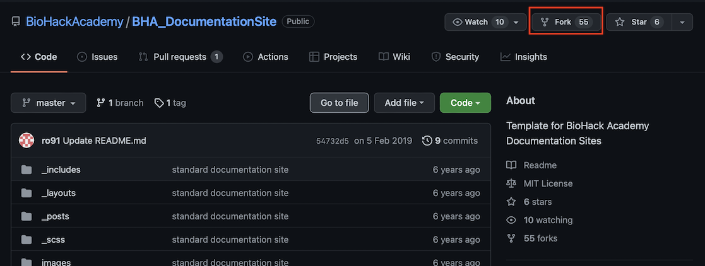
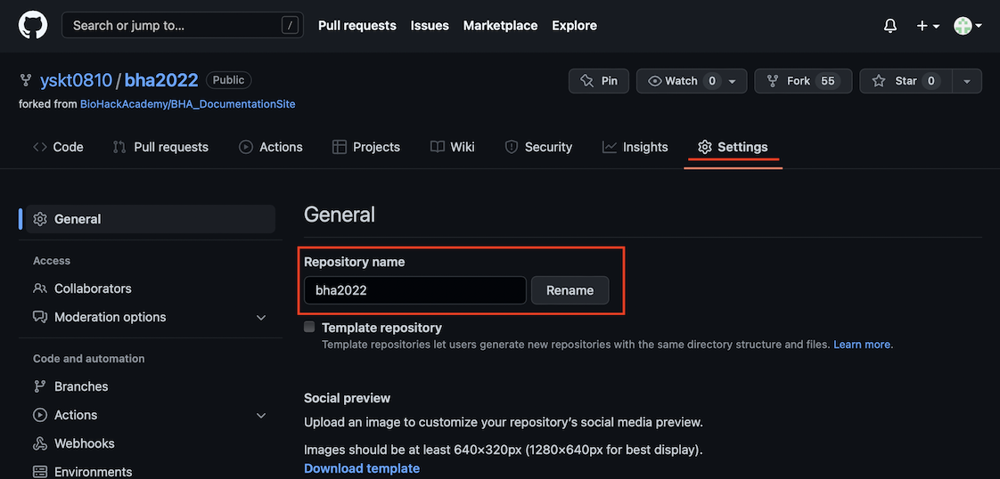
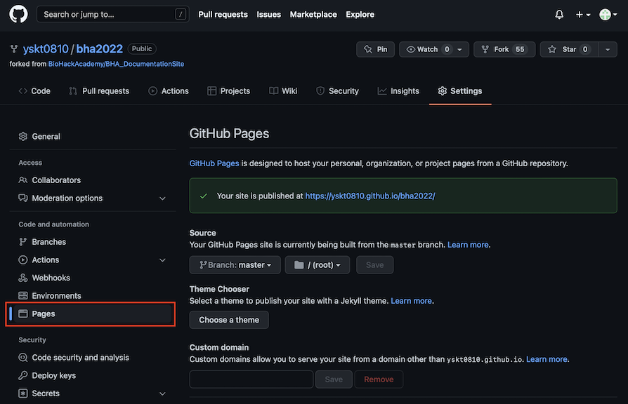
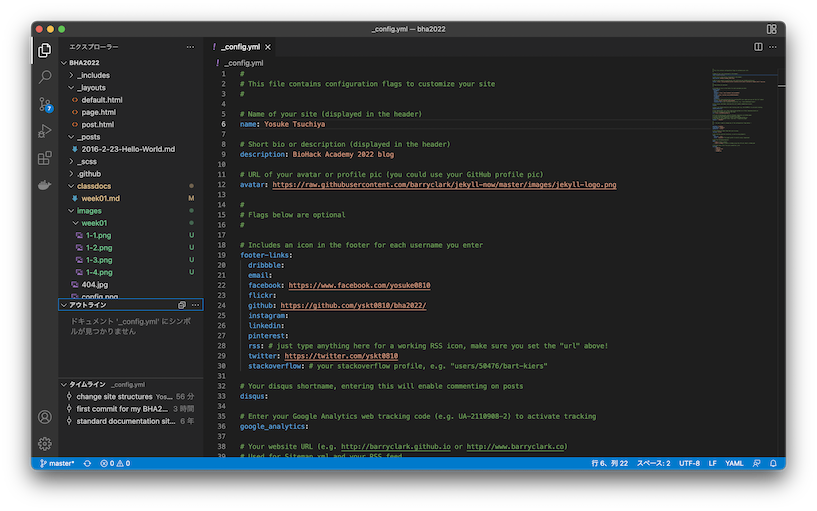
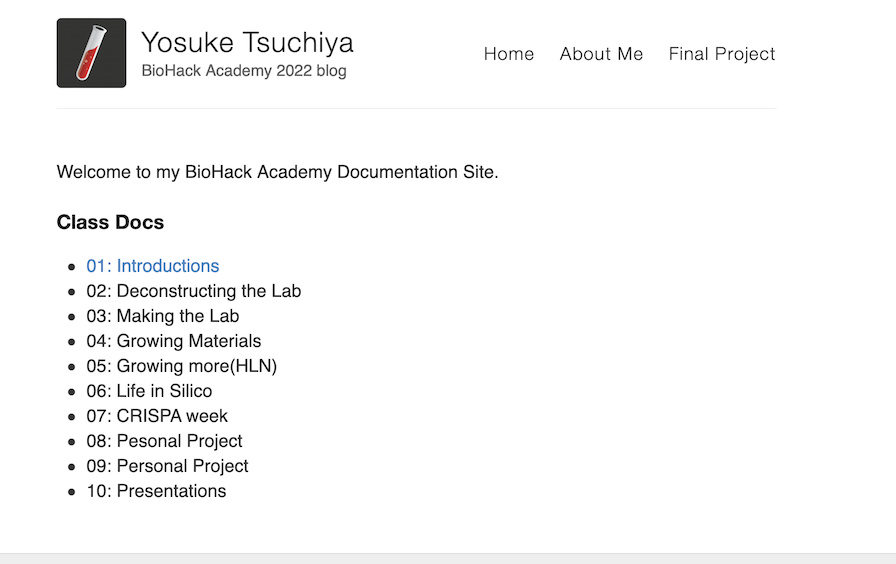
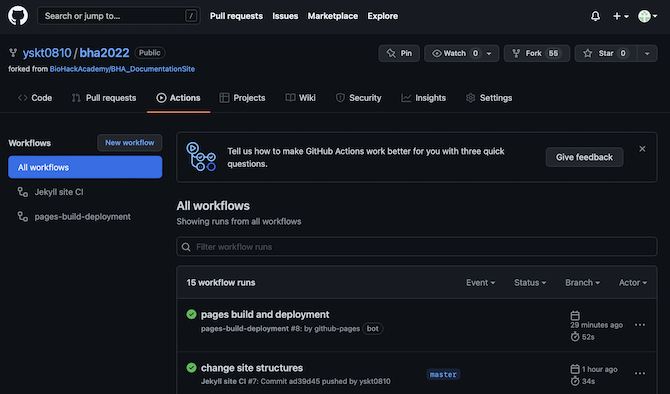

## Assignment:

- Make a public documentation site
- Make a About Page and introduce yourself
- Answer the following questions:
    - What is Life? How would you define it, can you actually define it?
    - What is BioHacking? What does it mean for you?
    - Why are you interested in Bio?

## Make Public Documentation Site.

I made my public documentation site on Github Page. Here are the procedures of setting up github pages.

1. Fork the repository of [BioHackAcademy Documentation Site Template](https://github.com/BioHackAcademy/BHA_DocumentationSite) (based on Jekylle Static Site Generators). How to fork the repository? You can find the "fork" button on top-right.



2. "Rename" the repository. You can change the repository name in "setting".



3. Setting Up GitHub Page. You can setup Github page at "Page" Section. Set a branch that publish to the pages. Here, I chooed the master branch of the repository.



4. Clone the repository into my Local Computer. Execute this command in my PC. You can copy the URL of repository from the button "Code".

```
git clone git@github.com:yskt0810/bha2022.git
```

5. Open the repository with the Editor (Here is the example of VS Code to open the repository).



6. Open _config.yml file to change some configurations of the website. The important parts of changes are here. You can also ckeck whole settings [here](https://github.com/yskt0810/bha2022/blob/master/_config.yml).

```

# Name of your site (displayed in the header)
name: Yosuke Tsuchiya

# Short bio or description (displayed in the header)
description: BioHack Academy 2022 blog

~~~~~

# Your website URL (e.g. http://barryclark.github.io or http://www.barryclark.co)
# Used for Sitemap.xml and your RSS feed
url: http://yskt0810.github.io

# If you're hosting your site at a Project repository on GitHub pages 
# (http://yourusername.github.io/repository-name)
# and NOT your User repository (http://yourusername.github.io)
# then add in the baseurl here, like this: "/repository-name"
baseurl: "/bha2022"

```

7. Commit and Push to the remote repository with these command.

Here is the commands that you can use for pushing the repository

- git add
- git commit
- git push

8. Wait a few seconds.... Then you can see the webpage are published!



You can check the publishing process in "Action".




## Make About Page

Open "about.md" in the template. And write my bio and profile, then push it into the repository.

About me page is [here](../about.md)

## Answering Questions

**What is Life? How would you define it, can you actually define it?**


**What is BioHacking? What does it mean for you?**


**Why are you interested in Bio?**