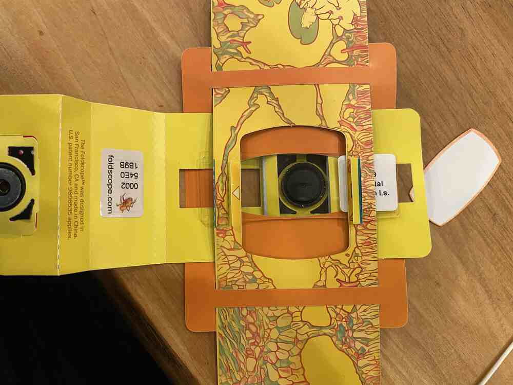
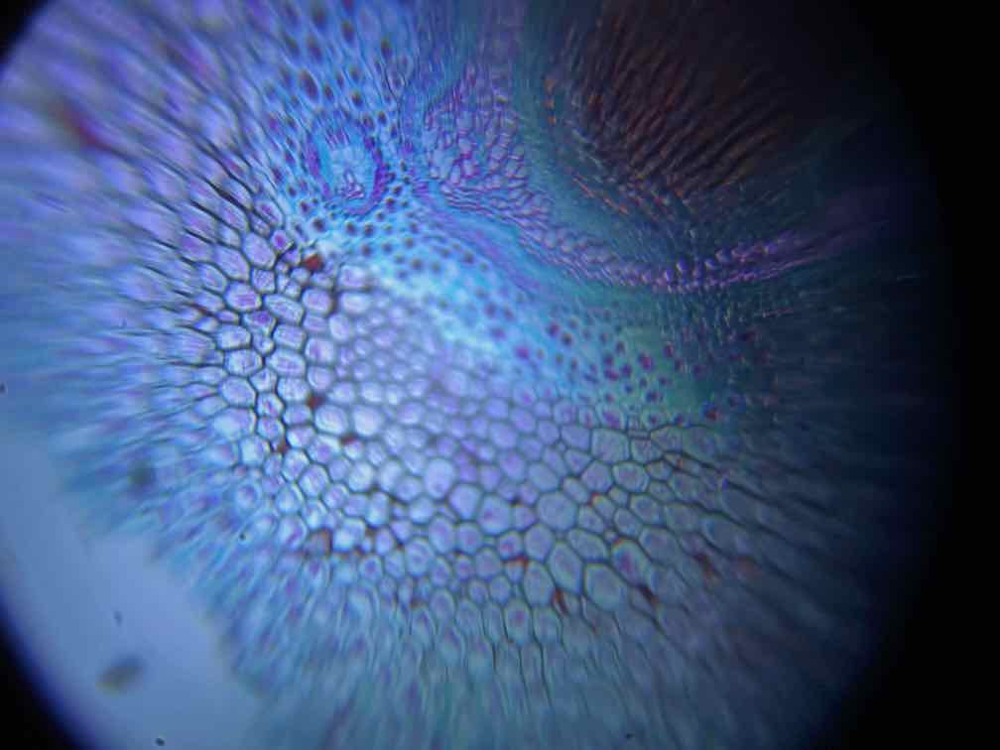

## What I did do this week ? 

I made some DIY Bio kits for simply bio search. Also, I deconstruct some bio lab equipments.

### Foldscope

Foldscope is a paper-based microscope. 

Foldscope Website: [https://www.foldscope.com](https://www.foldscope.com)

Foldscope is very easy to make with following the instruction manual.

I tried to make it.....

Finished to make. That looks nice.

Then, try to see the sample materials....

with setting it into the back of the glass.

.... Finally, I cound see the micro view of the sample materials.

### Pocket PCR (Thermocycular) 

The PocketPCR is a low-cost, small size thermocycler capable of activating biological reactions such as polymerase chain reaction (PCR). PCR is a method widely used in molecular biology to make copies of a specific DNA segment. Applications of the technique include DNA cloning for sequencing, analysis of genetic fingerprints, amplification of ancient DNA and gene cloning.

Website: [https://gaudishop.ch/index.php/product/pocketpcr-kit/](https://gaudishop.ch/index.php/product/pocketpcr-kit/)

Georg has some set of this kit and 3D printable case. So, I will try to build it.

Here is the kit parts.

First, I solderd some parts (rotaly switch and connector for power supply for the fan) to the PCB of Pocket PCR.

Next, I connected some screws and spacers... 

Finally, I put into the 3D printed case.

Connect to the power supply, and I can find the two menu "Run PCR" and "Setup" on OLED display. Rotate the switch and select "Setup".

In setup section, I can set the cycle of temperature up/down.

Then, Push "Start PCR". And, the left side temperature will raise.... 

<iframe src="https://player.vimeo.com/video/687819631?h=ea8e694a06" width="640" height="360" frameborder="0" allow="autoplay; fullscreen; picture-in-picture" allowfullscreen></iframe>

Here is the actual view that we use ti kit. We will set DNA sample into those small pipet and set on the heater.

I am interested the structure of the PCB, so I checked the backside. ATSAMD21 microcontroller is used for this PCB....?

### Deconstruct the PCR Thermocycular

Open the left top cover and we can find the place setting DNA samples.

Open the cover of the Thermocycular.... It is very exciting!

and we can find a big heatsink and something like a device to controll the temperature inside the stage of DNA samples.

## What I learned.

I learned some machines using in the BioLab. In my understanding, those machines are mainly separated into two roles 1) the machines that control the environment around the target materials (to make something like a biological reactions), 2) the machines that measure and check the material in nano/micro scale.

Also, I tried to make some DIY kit for bio hacking. It's my pleasure to know that some of the DIY Bio machine could make by myself (with the procedures of Digital Fabrications).

