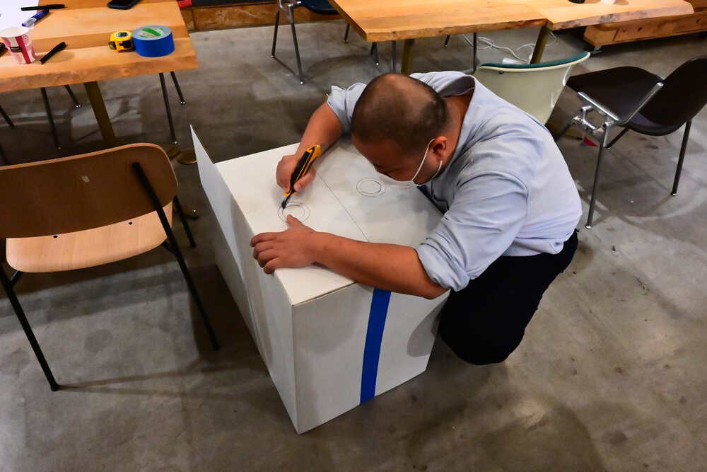

"Making the Lab" this topic is about Fab Lab and Digital Fabrication. In the lectures, there are a couple of fabricated machines for DIY Biohacking. In the lecture, I could see the overview of Waag Fab Lab, demonstration of 3D modelling by Autodesk Fusion 360. Then, some DIY Biohacking Kit are introduced. Those let me remember some lectures of [Computer-Aided Design](https://vimeo.com/673168884) and [What is Digital Fabrication](https://vimeo.com/670402018) in [Fab Academy](https://fabacademy.org/2022/).

### What I did in this week

1. Install and Test at least 2 different 3D Applications.

2. Hands-on Group Work: Design and Make a CleanBox

We had a workshop to make a Clean Bench by Cardboard. First, we draw some sketches to make ideas what kinds of functions are installed in Cleaan Box and how to design it. 

Because I still haven't understand well the role of the CleanBox, I couldn't imagine functions of it and struggled to design it.... 

We cut and build the cardboard with following our sketches.... This is the front view of our Cleanbox. We make a square hole to put hands into. 

Finally, finished to make....

It have small holes in both side of the Cleanbox for air passage. We can set a hair driyer (for alternate of the fan) to make air. 

My Groupmate are good at to make a typography of Kanji by Vinyl Tape. So, she made "風神" (meaning: The God of Wind) on the top of our Cleanbox. 

... An Bio Expart in our Bio Lab tried to use our Cleanbox.... Because the square hole for putting hands into our Cleanbox, she looked struggle to do her works inside there.... 

Well,,, it is complete to make it. In my experience of Fab Academy works, it is important to make moc-up by cardboard to understand what I want to make.... I thought I will learn more what the role of Cleanbox, and what are the role of every machines in Bio Lab....

3. Fork and Change the BHA Stirrer Repo

4. Prepare the PocketPCR Case for 3D Printing

