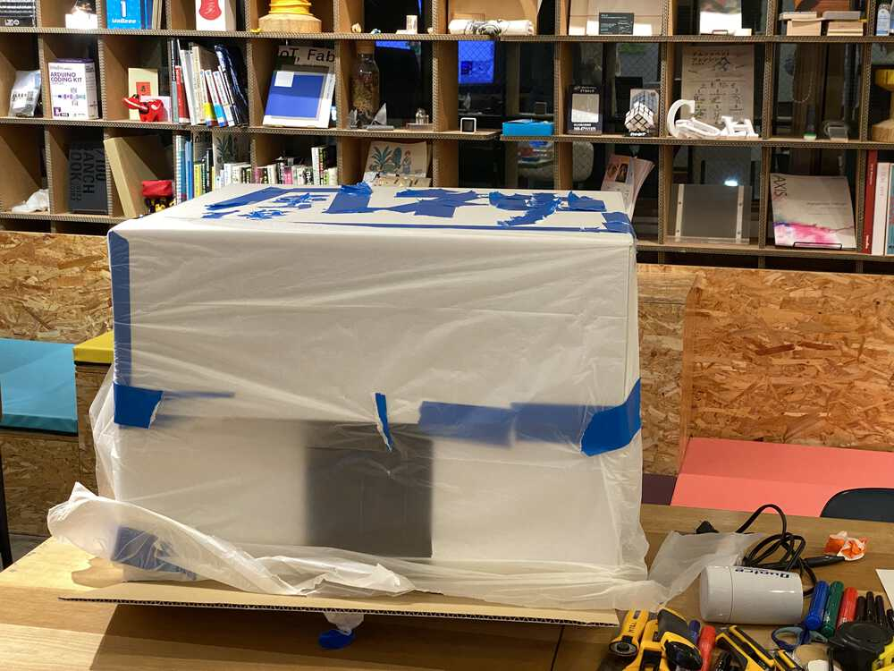
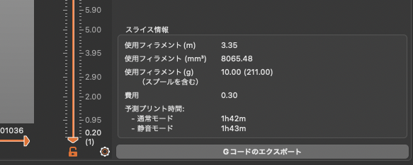

"Making the Lab" this topic is about Fab Lab and Digital Fabrication. In the lectures, there are a couple of fabricated machines for DIY Biohacking. Also, Waag Fab Lab are introduced, demonstration of 3D modelling by Autodesk Fusion 360. Then, some DIY Biohacking Kit are introduced. Those let me remember some lectures of [Computer-Aided Design](https://vimeo.com/673168884) and [What is Digital Fabrication](https://vimeo.com/670402018) in [Fab Academy](https://fabacademy.org/2022/).

## What I did in this week

Here is the list that Georg gave us the plan of this week assignment.

```
1. Demonstrate some 3D CAD software (at least two).
2. Hands-on Group Work: Design and Make a CleanBox
3. BHA Stirrer
4. PocketPCR Case for 3D Printing
```


### 1. 3D Design Software

I have ever used some 3D CAD software. Usually, I am using Autodesk Fusion 360, and it is very easy to make models. However, recently, Autodesk limited some functions in Free-version, also, I cannot use the educational license because I left the unviersity last year. So, now I am trying to learn some opensorce 3D CAD software such as FreeCAD, OpenSCAD, Blender and so on... 

### Autodesk Fusion 360

I will introduce some of my works by Autodesk Fusion 360

**Simple Core XY Pen Plotter**

This is what I made for learning how to make the machine. Core XY is a simple and powerful mechanical system. 


I made a 3D model of this machine by Autodesk Fusion 360.


The design is uploaded to the Autodesk 360 (Autodesk Cloud storage of 3D model). You can see here.

<iframe src="https://myhub.autodesk360.com/ue2bd73cf/shares/public/SH56a43QTfd62c1cd9680c153d3db3200de1?mode=embed" width="640" height="480" allowfullscreen="true" webkitallowfullscreen="true" mozallowfullscreen="true"  frameborder="0"></iframe>

[Here](http://fablabkamakura.fabcloud.io/FabAcademy/support-documents/SimpleCoreXYPenPlotter/) is a documentation page of Simple Core XY Pen Plotter.


**Sensing BEETLE**

Sensing BEETLE is my final project of Fab Academy 2019. 


I designed 6-legs linked mechanism and the body frame of the BEETLE robot by Fusion 360.


6-linkaged robot mechanism is looks here:


Those parts are projected to 2D Design and fabricated by laser-cutter.


Body frame is looks here:


The parts are exported as STL format, and load it with Flash Print (A 3D Slicer Software for FlashForge 3D Printer). 


Then, printed by Flashforge Dreamer.


The body frame is too big and it cannot print out at once. So, I separated the body into three parts printed separately. 


Finally, here is complete to fabricate (with using lasercutter (subtractive approach) and 3D Printer (additive approach))


Although the project satisfied requirements of Fab Academy Final Project, this project still have not completed in two points. One is the electronics part. It does not install the logging and visualizing mechanism via WiFi or Bluetooth (need to revise the PCB based on ESP32). Another is the design part. The mechanism and body frame of the robot is separated, and the body frame is easy to blow away.... Need to re-design the mechanism and body frame... 

#### FreeCAD

Coming Soon.....

--- 

### 2. Hands-on Group Work: Design and Make a CleanBox

We had a workshop to make a Clean Bench by Cardboard. First, we draw some sketches to make ideas what kinds of functions are installed in Cleaan Box and how to design it. 


Because I still haven't understand well the role of the CleanBox, I couldn't imagine functions of it and struggled to design it.... 


We cut and build the cardboard with following our sketches.... This is the front view of our Cleanbox. We make a square hole to put hands into. 


Finally, finished to make....



It have small holes in both side of the Cleanbox for air passage. We can set a hair driyer (for alternate of the fan) to make air. 


My Groupmate are good at to make a typography of Kanji by Vinyl Tape. So, she made "風神" (meaning: The God of Wind) on the top of our Cleanbox. 


... A Bio Expart in our Lab tried to use our Cleanbox.... Because the square hole for putting hands into our Cleanbox, she looked struggle to do her works inside there.... 


Anyway,,, it is complete to make it. In my experience of Fab Academy works, it is important to make moc-up by cardboard to understand what I want to make.... I thought I will learn more what the role of Cleanbox, and what are the role of every machines in Bio Lab....

---

### 3. Fork and Change the BHA Stirrer Repo

I forked [github repository of BHA Stirrer](https://github.com/BioClub/BHA_Stirrer) (DIY Magnetic Stirrer). 


Then, cloned into my PC and open it.


I found the BoM for Japan file, then checking the list....


Most of the parts in BoM could by in Japanese Online Mechanical/Electronics Parts shops, but some parts are missing the link

- 7.5W Power Supply

So, I am looking for where I can buy it.... 

### 4. 3D Printing of Pocket PCR (Preparation)

The meaning of "Preparation" is to make a CAM file (like G-Code) for 3D printing by using a slicer software.

I have my own 3D Printer, Prusa i3 MK3.


So, I will make a G-Code for this printer by using Prusa Slicer.

First, download a STL file of Pocket PCR case from [here](https://www.thingiverse.com/thing:4094823). Then, open the STL file with Prusa Slicer.


Rotate the model 90 degree in X-Axis.


Make slice the model, then we can see the preview of sliced model.


From to the preview, we can see it takes about 1 hour and 43 minutes for printing.



Then, Push "Export G-Code" on the Right Bottom side of the Slicer.

[Here](../files/PocketPCR_Case_0.15mm_PLA_MK3S_1h42m.gcode) is the G-Code file that exported.


