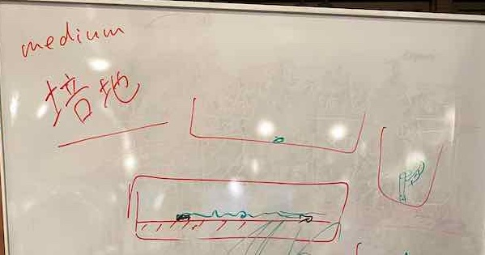

## Growthing Medium

We start our lab activities. This week, we make a growth medium (culture medium) by gelrite. Grouwh medium is to support the growth of a population of microorganisums or cells. 

Here is a materials for making a growth mediums

Gelrite ... 4g. We use the gelrite in the lab.

Pure Water ... 500ml

1. 