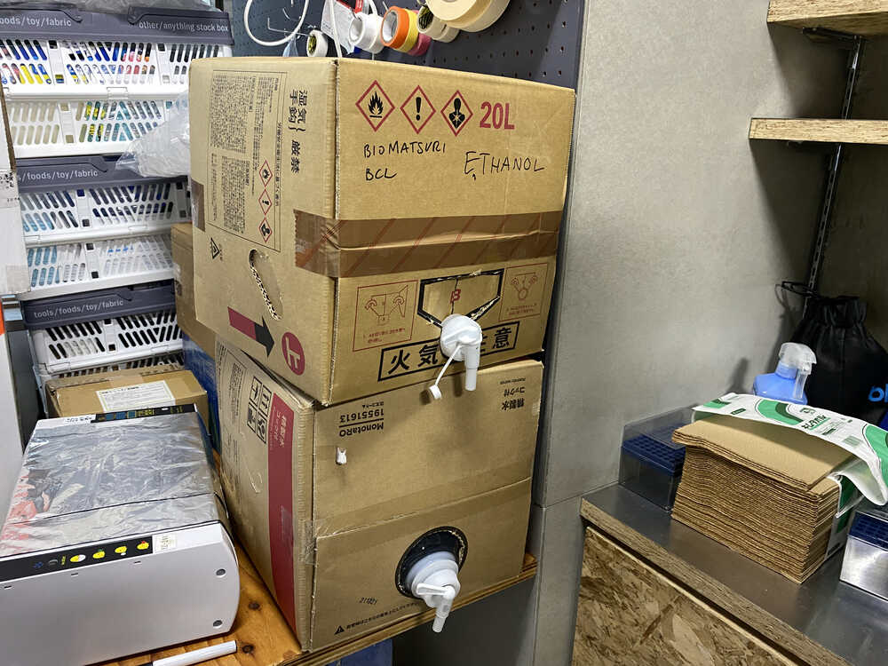
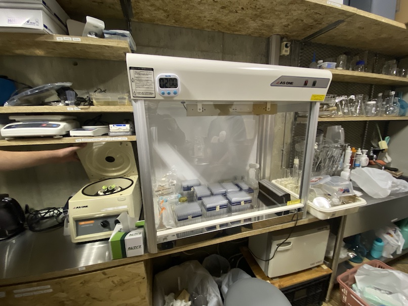
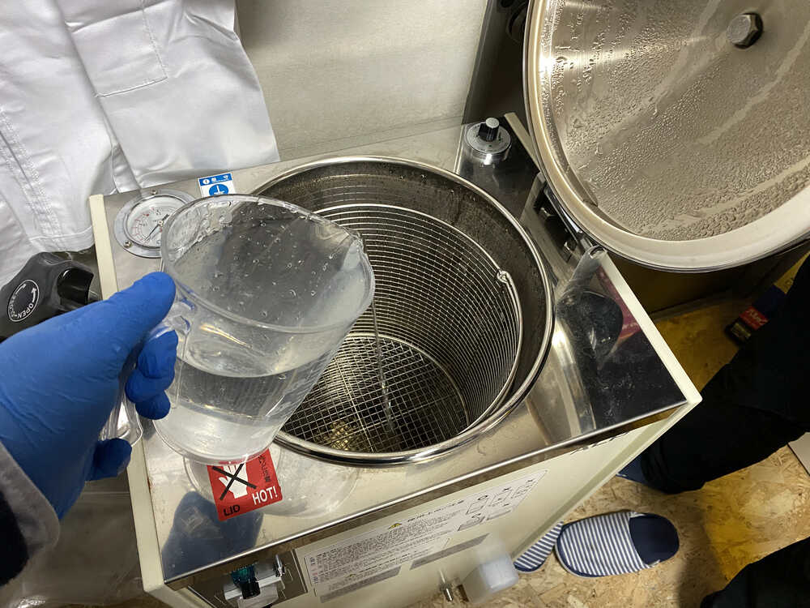

From this week, we start the lab activities for bio hacking. Here is the assignments of this week from Georg.

1. Learn and document how to make cultivation media for bacteria and plants
2. Tutorial session (individually or in groups) about your potential final project (zoom or in person).
3. Update your Final Project Page, outline/sketch/describe one or more potential project
4. Use the 10 Petri Dishes and make home-made medium

Here, I write how to cultivate the medium for bacteria in both Lab and my Home.

## Growthing Medium (in the Lab)

This week, we make a growth medium (culture medium) by gelrite. Grouwh medium is to support the growth of a population of microorganisums or cells. 

### Prepare materials and machines

Here is a materials for making a growth mediums

Gelrite ... 4g. We use the gelrite in the lab.

Pure Water ... 500ml. Also, we have a small tank for storing it.

Those are machines that we use in our lab.

- magnetic stirrer to mix pure water and galrite.

- Autoclave for stelization.

- Cleanbench for pouring the medium

### Procedures 1: Mixing 

First, measure 500ml pure water in a beaker.

Then, put pure water into one bottle.

We use a magnetic stirrer to mix pure water and gelrite later, so we put the magnet into the bottle.

Adjusting the magnetic stirrer..... for woking mixing.

Measure 4g gelrite by digital scaler.

Put gelrite into the bottle.

Start mixing....

If not well mixed, it is better to shake the bottle....

After mixed and shaked, we close the cap. Not close the cap tightly, a little bit loosen.

### Procedure 2: Sterilization

Well,,, we are ready to sterilize our mixed gerlite by Autoclave. First, we check the inside of autoclave whether the water (dirty) is still remained or not.

Still water remained... So, we remove the dirty water from the bottle of the autoclave.

Check inside again.... and the water were removed.

Put Pure water into the water.

Set the mixed bottle inside.

Then, close the door of autoclave.

Then, turn on the button.... wait one and half hours to finish sterilization... (up temperature to 120 Celcius for compressing).

### Procedure 3: Pouring the medium into Petri Dish

After finished sterilization.... Open again the autoclave.

Set the bottle in the cleanbench.

Absorb the medium from the bottle. The bottle is too hot, so we use the big pipet for absorbing...

Put the medium into the petri dish... To keep the pure environment, the cover of petri dish should be opened a little bit enough the space that insert the pipet. Not the cover fully open.

After finished to put all medium into the petri dish, we set them inside cleanbench and wait to cool down and solid the medium.

If it become solid, turn over the petri dish.

## Making agar medium in the Home (DIY growth medium)

Coming soon.

