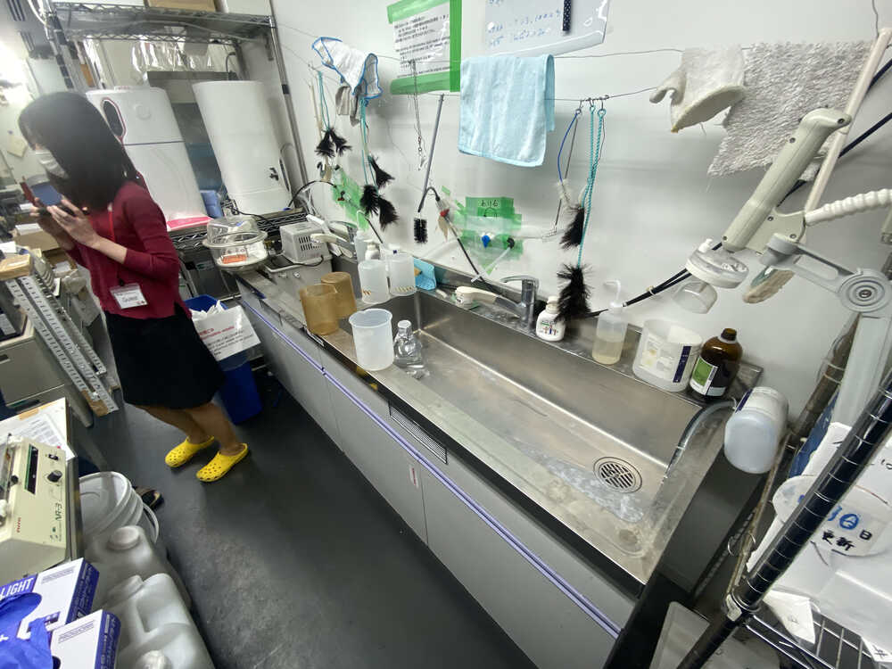
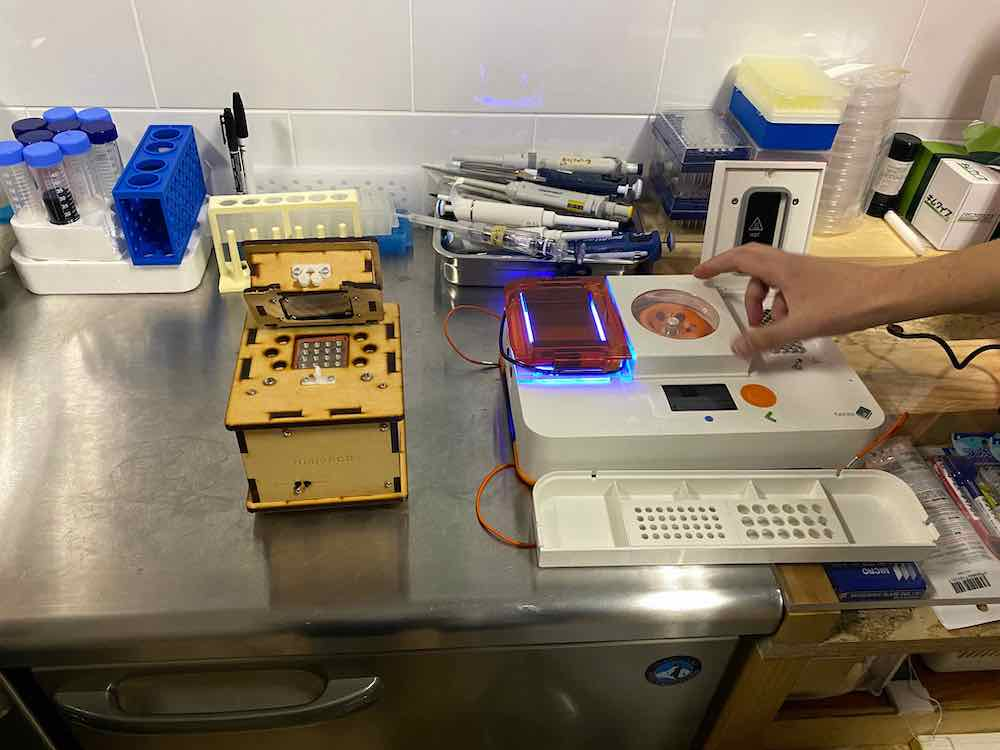

This week, we visited Professor Iwasaki's labratory (Waseda University). So, we couldn't attend the class in live. So, we check the class video later. The note of the lecture "Life in Silico" is interesting but difficult to me. So, I will make a memo of the lecture, later.

## Assignment Works

This week assignment from Georg....

- Compare Waseda Lab and BioClub Lab. List at least 5 things that are similar or different.
- Watch the [Digital DNA Design](https://vimeo.com/696442612) Lecture, we will review it Monday at 16:30. Please also make screenshots and write in your documentation things that are new to you.

## Visiting TWins Prof.Iwasaki's Laboratory.

We visited [Professor Iwasaki's](https://hideo-iwasaki.com/work) laboratory located in [Waseda University Center for Biomedical Science (TWIns)](https://www.waseda.jp/inst/twins/en/).

<iframe src="https://www.google.com/maps/embed?pb=!1m18!1m12!1m3!1d3240.1618050071543!2d139.71945371586287!3d35.697635680190274!2m3!1f0!2f0!3f0!3m2!1i1024!2i768!4f13.1!3m3!1m2!1s0x60188ce52c8ea001%3A0x79f2b7425642a965!2z5pep56iy55Sw5aSn5a2mIOWFiOerr-eUn-WRveWMu-enkeWtpuOCu-ODs-OCv-ODvO-8iFRXSW5z77yJ!5e0!3m2!1sja!2sjp!4v1649603320171!5m2!1sja!2sjp" width="600" height="450" style="border:0;" allowfullscreen="" loading="lazy" referrerpolicy="no-referrer-when-downgrade"></iframe>

First, there are so many different between Iwasaki Lab and BioClub Lab, in scale, quality, staffs,,, and so on. And, those are natural. One is a "advanced" biological and medical laboratory by the most famouse private university in Japan. Another is a small (and innovative) citizen community BioLab. Those are something similar dilemma between advanced mechanical electronics lab in university (company) and the community-based Fab Lab. I don't want to criticize or complain about community lab by compareing with university advanced lab. I want to find out the potential possibilities by comparing. So, I will observe with focusing more on similarities than differences among two labs.

### Similarity 1: Entrance Mannar

In the entrance of Iwasaki Lab, I can find the shoe rack. We have to change our shoes to sandals for keeping the lab clean and safety. 

Also, I can find the sink to wash hands, dishes or something.... It is also same with the BioClub lab.

### Simlarity 2: Microscope and Imaging

I can find some microscopes and imaging tools on the desk where is nearest from the entrance door. Of course, those tools are professional level and seems expensive than the microscope in the BioClub lab... That is natural.

Also, there are some computers connecting to those microscopes. Webcam are mounted on the microscope and we can trace the image from the microscope in live by using those computers.

Microscope and imaging tools are basic equipment for measuring and anayisis microorganism. BioClub Imaging tools are not connected to the computer, but it does not the problem and we can microscopes that connect to PCs... by digital fabrication...

### Similarity 3: Equipments

I can find a incubators? near from the entrance door of the lab. 

Here is the incubator in the Bioclub Lab. Incubators are also basic equipment for pure culture.

I can also find cleanbenches. Iwasaki lab havs two cleanbenches....

Here is the cleanbench in the Bioclub lab. Looks a little bit small and BioClub has one cleanbench. 

### Similarity 4: DIY part in equipments

Of course, there are a lot of original equipments in Iwasaki Lab. Some of them makes P2 Level experiments enables. However, hearing from the lecture of Prof.Iwasaki, I can find some parts in those equipments are made by hand.

For example, this big equipment is original in Iwasaki Lab.... 

Some Inside parts of this equipments seems to be made by hand.

Also, innermost of the lab, there is a big incubator box. 

And, there are some parts which looks DIY tools for keeping liquid mediums.

BioClub has also DIY minds... Here is some equipments in BioClub Lab.

### Difference: Aquariums

The most part I impressed as a difference is areas that keeps living things (animals, plants, aquatic organism) alive... in common area for all labs in TWIns. Especially, I am very surprised that they have a Aquatic Animal Area...

This wide area have so many aquariums and aquatic animals.... 

I didn't think I could meet with the flog in the lab...

### Summary

Seemingly, Iwasaki Lab has full and rich equipments for experiments for biological experiments.  Looking at the Iwasaki Laboratory, I thought there are some common elements (manars and basic equipments) installed in each lab in each scales. 

## Digital DNA Design 

This is interesting part. But, there are a lot of technical terms... So, I took memos of each technical terms.

Genome: ゲノムとは？

ゲノム（genome）は、gene（遺伝子）と集合を表す "-ome"を組み合わせた言葉で、生物の持つ遺伝子（遺伝情報）の全体を指す言葉。その実態は生物の細胞内にあるDNA分子であり、遺伝子や遺伝子の発現を制御する情報などが含まれる。

CRISPR (or CRISPR-Cas9)

Clusterd Regularly Interspaced Short Palindromic Repeats

日本語メモ（参考：「[ゲノム編集とは？遺伝子組み換えとの違いや危険性、応用の可能性を解説](https://www.rd.ntt/se/media/article/0012.html)」）
ゲノム編集は、生物が持つゲノムDNA上の特定の塩基配列を狙って変化させる技術。外来の遺伝子を細胞に導入して新しい形質を付け加える遺伝子組み換えに対して、細胞がもともと持っている性質を細胞内部で変化させることが特徴。

そして、ゲノム編集に使用されるツールがCRISPR-Cas9というもの。[2020年のノーベル化学賞を受賞](https://www3.nhk.or.jp/news/special/nobelprize2020/chemical/news/news_08.html)した、エマニュエル・シャルパンティエとジェニファ・ダウトナにより開発された手法であり、それまでのゲノム編集の方法に比べて簡単で効率がよく、より自在に遺伝情報を書き換えることができ、生命科学の飛躍的発展に貢献した。

CRISPR-Cas9でのゲノム編集の手法が、、、RNAを用いた転写。。。

授業では、In Silico の名の通りコンピュータ上でゲノム編集を行う手順が紹介されている。

なんかバイナリー編集みたいだ。。。

Online Tools to select sqRNAs

特定のRNAを選択するためのオンラインツール群の紹介

