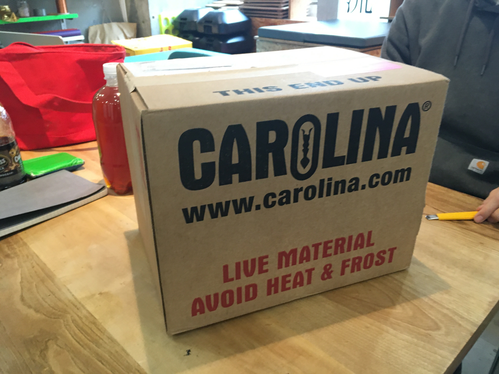
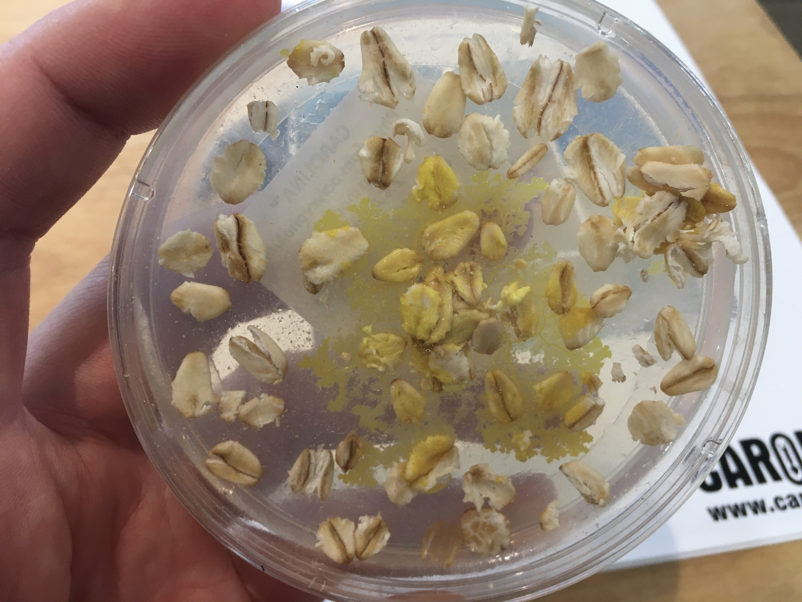
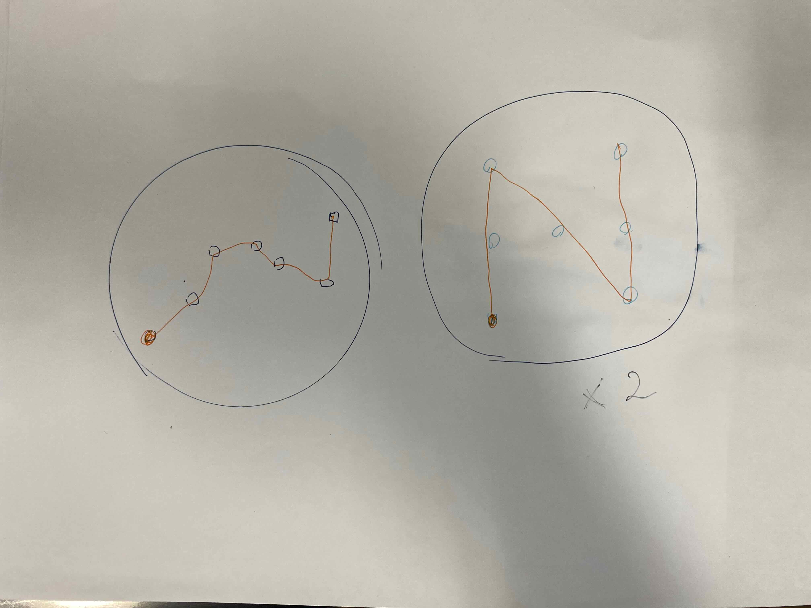
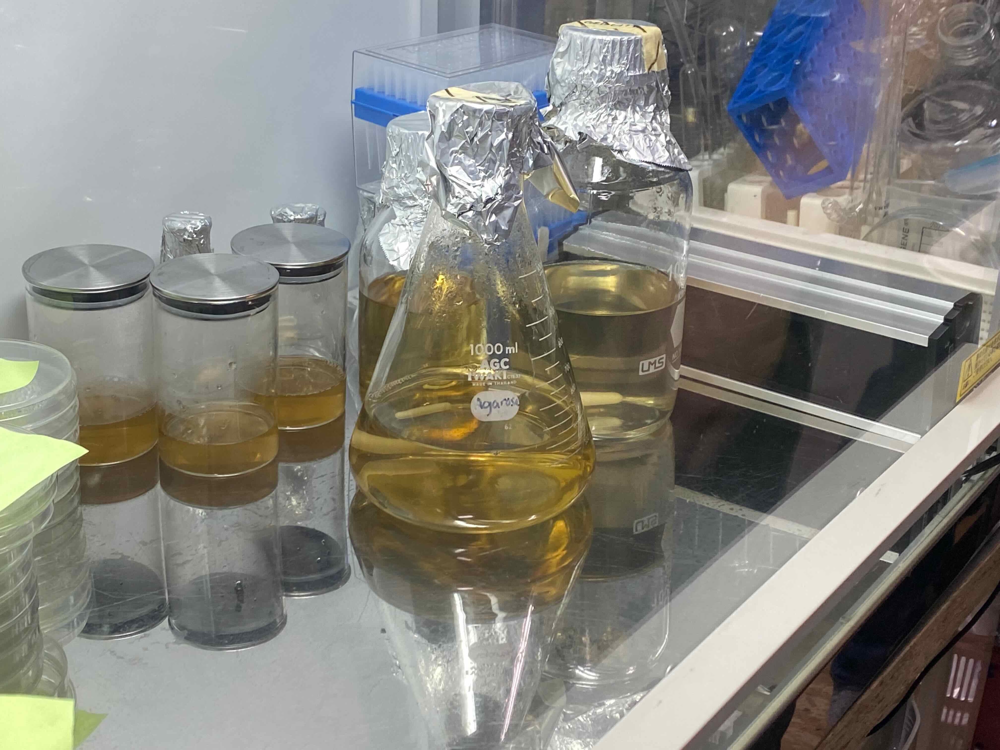
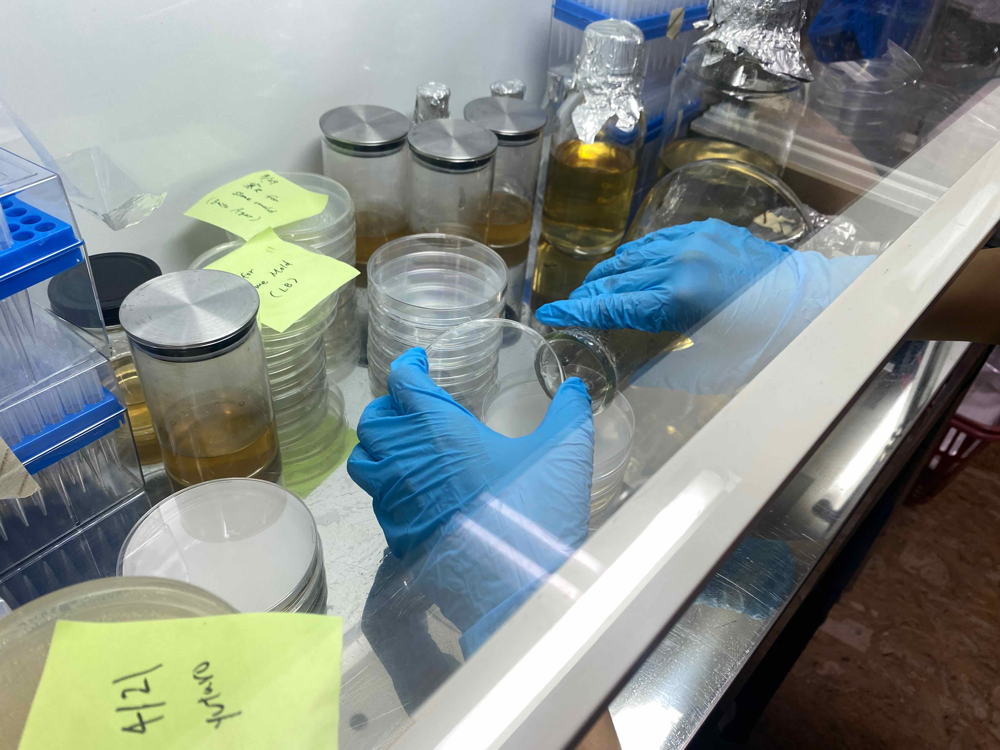

In this section, we tried to cultivate slime mold.

### About Slime Mold

From the document of [CARILINA Physarum Manual](../images/week07/PhysarumManual.pdf):

- Slime Molds possess characteristics that cross typical taxonomic boundaries -> That's because classification of Physarum polycephalum has long challenged scientists.
- Physarum is an intriguining organism that can be used to introduce, discuss, or reinforce many subjects, including life cycles, mitosis, meiosis, sexual and asexual reproduction, cytoplasmic streaming, chemotaxis,,,, and developmental biology.
- Most interesting point I found from the document is... about its sexual production. 

And, I found the interesting feature of slime mold on YouTube. Slime mold navigate the quickest route througn a maze to get it sme food...

<iframe width="560" height="315" src="https://www.youtube.com/embed/HyzT5b0tNtk" title="YouTube video player" frameborder="0" allow="accelerometer; autoplay; clipboard-write; encrypted-media; gyroscope; picture-in-picture" allowfullscreen></iframe>

So, we tried to experiment it. 

### Procedure

The slime mold came from America。

First, we sketched how does the slime mold move and draw the route to some foods. The left one is drawing the pathway of Tokyo Metro Hanzomon Line. The right one is drawing just I interested whether the slime mold could move among foods in expected orders.

We use a pure agar medium to cultivate the slime mold. 

We put agar into the petri dish.... It have to be worked in the clean bench. Then, waiting a couple of hours to solidify the agar medium. 

We use a oatmeals as a foods of slime mold.

