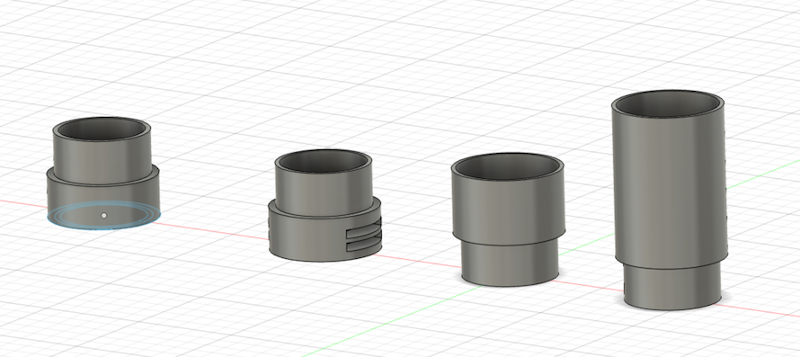
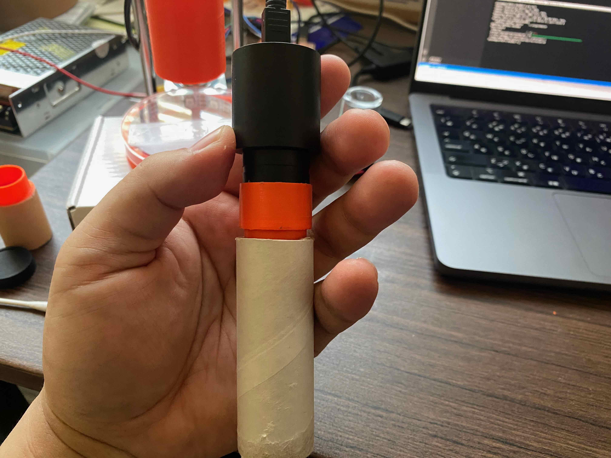

## Motivations

I was enjoy the BioHack Academy 2022 both online lectures and workshops at Bioclub Tokyo. I learnd so much about knowledges, skills and literacies of Biohack in local labs and in my home. 

However, I have not good at how to "apply" biohack to my life. How can I use those skills to make our life better or happier? Or those biohack knowledges and skills could use for what? Those are what I will seek from now on, and I need to make my own Bio hack environment in my home (because there are not so much time that I will come to the lab). "Building DIY Biohack environment in my home" is my basic motivation for my final project. 

And, as the first step of this project, I decided to make an microscope with mobilizing my knowledge and skills of digital fabrication.

## Bill of Materials

To make a Fab Hack Microscope, we need to buy those items. 

| Material Name | num | Link |               appendix                              | 
|---------------|-----|------|-----------------------------------------------------|
| 3D Printer CNC Kit 3D Printer Accessories | 1 |[Amazon](https://www.amazon.co.jp/-/en/gp/product/B083Q75HSF/)| it includes NEMA 17 Stepper motors to control X,Y,Z axises of Microscope lens.
| Eyepiece Webcam | 1 | [Amazon](https://www.amazon.co.jp/-/en/gp/product/B07Z8LKKDZ/?th=1)|
| Arduino UNO Rev 3 | 1 | [Amazon](https://www.amazon.co.jp/dp/B008GRTSV6)|
| Neopixel Tape WS2812B | 1 | [Adafruit](https://www.adafruit.com/product/1376?length=1)|
| Objective Lens | 1 | [Amazon](https://www.amazon.co.jp/-/en/gp/product/B07PM73VFD/)|
| convex lens 13mm f=65 | 2 | [Amazon](https://www.amazon.co.jp/dp/B0091FQOQY) | You need it if you make your own objective lens    |
| Lead Screw Copper Nut (150mm, 8mm pitch) | 2 | [Amazon](https://www.amazon.co.jp/-/en/gp/product/B07RB5NPV8/) | 
| Lead Screw Rod | 2 | [Amazon](https://www.amazon.co.jp/-/en/gp/product/B07RB5NPV8/) |
| Beam Coupling Motor Shaft Coupler | 2 | [Amazon](https://www.amazon.co.jp/-/en/gp/product/B07ZMYSYLH/?th=1) |
| C Shaft SN | 2 | [monotaro](https://www.monotaro.com/p/3747/3843/?displayId=5) | size: 8mm (radius), length: 250mm |
| liner Bushing Straight | 2 | [monotaro](https://www.monotaro.com/p/0360/7923/?displayId=5) | inside hole radius: 5mm, outer radius: 16mm |

## Design and 3D Printing

### Body of Microscope

Use wrap core as a main body of the microscope, then modelling and printing adapters of the an eyepiece webcam and a objective lens.

Designing by Fusion 360:

Then, printed and assembled. 

### Desiging Objective Lens

We can make our own objective lens by using two convex lens. Here, I make it by using this f65 13mm convex lens.

### Z-Axis Mechanism
　
The most important part of desiging in 1st version is a mechanism of Z-axis up/down with holding the body of microscope that assembled Eyepiece Webcam and Objective Lens. I used a NEMA Stepper motor for controlling up/down and designed with inspiring from [the mechanism of 3D Printer Z-axis](https://forum.duet3d.com/topic/16486/choosing-a-z-axis-style/9).

Here is the Fusion 360 view:

## Electronics

