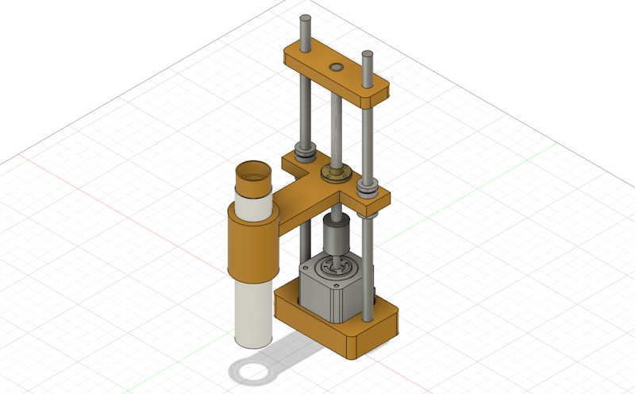
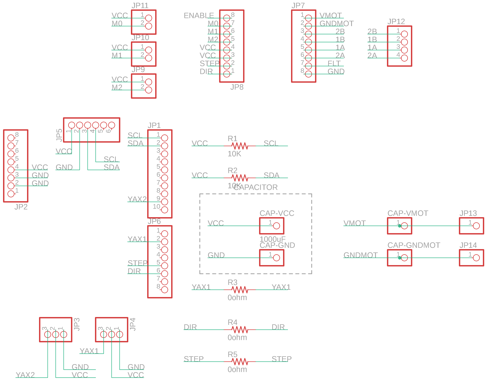

All source codes and design files are available here:
[https://github.com/yskt0810/BHA2022FP-FabHack-Microscope](https://github.com/yskt0810/BHA2022FP-FabHack-Microscope)

## Motivations

I was enjoy the BioHack Academy 2022 both online lectures and workshops at Bioclub Tokyo. I learnd so much about knowledges, skills and literacies of Biohack in local labs and in my home. 

However, I have not good at how to "apply" biohack to my life. How can I use those skills to make our life better or happier? Or those biohack knowledges and skills could use for what? Those are what I will seek from now on, and I need to make my own Bio hack environment in my home (because there are not so much time that I will come to the lab). "Building DIY Biohack environment in my home" is my basic motivation for my final project. 

And, as the first step of this project, I decided to make an microscope with mobilizing my knowledge and skills of digital fabrication.

## Bill of Materials

To make a Fab Hack Microscope, we need to buy those items. 

| Material Name | num | Link |               appendix                              | 
|---------------|-----|------|-----------------------------------------------------|
| 3D Printer CNC Kit 3D Printer Accessories | 1 |[Amazon](https://www.amazon.co.jp/-/en/gp/product/B083Q75HSF/)| it includes NEMA 17 Stepper motors to control X,Y,Z axises of Microscope lens.
| Eyepiece Webcam | 1 | [Amazon](https://www.amazon.co.jp/-/en/gp/product/B07Z8LKKDZ/?th=1)|
| Arduino UNO Rev 3 | 1 | [Amazon](https://www.amazon.co.jp/dp/B008GRTSV6)|
| Neopixel Tape WS2812B | 1 | [Adafruit](https://www.adafruit.com/product/1376?length=1)|
| Objective Lens | 1 | [Amazon](https://www.amazon.co.jp/-/en/gp/product/B07PM73VFD/)|
| convex lens 13mm f=65 | 2 | [Amazon](https://www.amazon.co.jp/dp/B0091FQOQY) | You need it if you make your own objective lens    |
| Lead Screw Copper Nut (150mm, 8mm pitch) | 2 | [Amazon](https://www.amazon.co.jp/-/en/gp/product/B07RB5NPV8/) | 
| Lead Screw Rod | 2 | [Amazon](https://www.amazon.co.jp/-/en/gp/product/B07RB5NPV8/) |
| Beam Coupling Motor Shaft Coupler | 2 | [Amazon](https://www.amazon.co.jp/-/en/gp/product/B07ZMYSYLH/?th=1) |
| C Shaft SN | 2 | [monotaro](https://www.monotaro.com/p/3747/3843/?displayId=5) | size: 8mm (radius), length: 250mm |
| liner Bushing Straight | 2 | [monotaro](https://www.monotaro.com/p/0360/7923/?displayId=5) | inside hole radius: 5mm, outer radius: 16mm |

## Design and 3D Printing


### Body of Microscope

Use wrap core as a main body of the microscope, then modelling and printing adapters of the an eyepiece webcam and a objective lens.

Designing by Fusion 360:


Then, printed and assembled. 


### Desiging Objective Lens

We can make our own objective lens by using two convex lens. Here, I make it by using this f65 13mm convex lens.


Convex Lens Adapter designed to insert two lens with interval about 1mm.


Then, printed out and assembled the lens.


### Z-Axis Mechanism
　
1st version is implemented a mechanism of Z-axis up/down with holding the body of microscope. I used a NEMA Stepper motor for controlling up/down and designed with inspiring from [the mechanism of 3D Printer Z-axis](https://forum.duet3d.com/topic/16486/choosing-a-z-axis-style/9).

I used the following mechanical parts and made 3D models to assemble each parts.

- Lead Screw Copper Nut (150mm, 8mm pitch)	x 2
- Lead Screw Rod x 2
- Beam Coupling Motor Shaft Coupler	x 2	
- C Shaft SN x 2
- liner Bushing Straight
- NEMA 17 Stepper Motor

Here is the Fusion 360 view:



Then, printed the parts and assembled.


## Stage with Backlight

Then, make a stage of the sample with backlight. I used Neopixel Full Color RGB Tapes for backlight the microscope.

First, modelling the stage, with making a hole to insert Neopixel Tape.


Then, printed and assembled.


## Electronics

Now is the part for elctronics. The objective of the electronics part is to design the electronic circuit to control the stepper motor and Neopixel. In this time, Fab-Hack Microscope use the Arduino UNO as a main microcontroller board. Then, I designed the Shiled PCB that Assemble DRV8825 Stepper Motor Driver and Neopixel.

### Shield Design

I used Autodesk EAGLE to design the Shiled PCB. Here is the schema:



Then, make a design of the shield.


And, also make a outline of the shield.


### Shield Fabrication

Then, I made a CAM file to mill the sheid by Roland SRM-20. We can use [MODS](http://modsproject.org/) for making CAM file for it. 

First, export circuit trace line and outline of the shield as PNG file as follow. Here is the circuit trace file.


Here is the outline file.


Then, open MODS and setting parameter as follow. Then, import the PNG files.

1. Open Server Program -> Machine -> Roland SRM-20 PCB
2. In "Read PNG" section, push "select png file" button and read the PNG file.
    - if you use Apple Computer for exporting PNG file, you should change dpi rate to double size. For example if the dpi in origina would be 800, then you should change the rate to 1600 (it is the issue of Ratina Display on Apple Computer)
3. In the section of "set PCB Default", choose the appropriate parameter to mill the board.
    - If you mill the trace line, push "mill trace (1/64)". If you mill the outline, push "mill outline (1/32)".
4. In the section of "Roland SRM20 Milling Machine", you should set the origin x, y, z all to 0 (zero).
5. Add a module "file save", then connect input node to "Roland SRM-20" output node.
6. Then, push "calculate" button in "mill raster 2D" section.


Then, the CAM file is generated, and we can check the trace line on MODS.


Use Roland SRM-20 to mill the board. In this time, I used Fab Lab Kamakura's SRM-20.


Then, mill the board and soldered the parts.


### Embedded Programming

I made an Arduino code to control the stepper motor and Neopixel. 

### Stepper Motor Control

I want to control stepper motor from the Interface Application on PC (mationing later). So, I implemented the function of serial communication to transmit/send a signals for controlling. Also, I wanted to change the up/down speed rate flexibly.


Here is the code of stepper motor section. The dir pin and step pin for stepper motor driver (DRV 8825) is assigned as Arduino UNO digital pin 2 (dir ) and digital pin 3 (step) by the Shield that fabricated above. 

```
const int dirPin = 2;
const int stepPin = 3;

const int steps = 1600;
int stepDelay;
int mode = 2; // 0: stepper control, 1: stepper adjustment, 2: menu
int step_interval = 10;

'''

void control(){

  if(Serial.available()){
    stepDelay = 250;
    char val = Serial.read();
    
    if(val == 'U'){
      digitalWrite(dirPin,HIGH);
      for(int x=0; x<step_interval; x++){
        digitalWrite(stepPin,HIGH);
        delayMicroseconds(stepDelay);
        digitalWrite(stepPin,LOW);
        delayMicroseconds(stepDelay);
      }
    }
    else if(val == 'D'){
      digitalWrite(dirPin,LOW);
      for(int x=0;x<step_interval;x++){
        digitalWrite(stepPin,HIGH);
        delayMicroseconds(stepDelay);
        digitalWrite(stepPin,LOW);
        delayMicroseconds(stepDelay);
        
      }
    }
    else if(val == 'L'){
      step_interval = 100;  
    }
    else if(val == 'S'){
      step_interval = 10;
    }
  }
}

```

### Neopixel

Neopixel Part seems simple, but one problem occur. Neopiel Full Coloer LED could bright any kinds of colors with mixing and balancing brightness of R(Red), G(Green), B(Blue) light. If all color RGB set as mamimum, then the neopixel show white color. But, as show the following picture, the green LEDs is much more brightly than the red or blue LEDs, this means that any color you try to mix is inherently 'too green' unless you correct for that somehow. 


*Source: [https://github.com/FastLED/FastLED/wiki/FastLED-Color-Correction](https://github.com/FastLED/FastLED/wiki/FastLED-Color-Correction)*

So, I used FastLED library for color corrections to bright stage light in white. Here is the code of Neopixel part.

```
#include <FastLED.h>
#define NUM_LEDS 12
#define DATA_PIN 9

'''
CRGB leds[NUM_LEDS];

void setup() {
  // put your setup code here, to run once:
  FastLED.addLeds<NEOPIXEL, DATA_PIN>(leds,NUM_LEDS);
  
  FastLED.setCorrection(TypicalPixelString);
  FastLED.setTemperature(CoolWhiteFluorescent);
  FastLED.setBrightness(128);
}

void loop() {
  // put your main code here, to run repeatedly:

  leds[0] = CRGB::White;
  leds[1] = CRGB::White;
  leds[2] = CRGB::White;
  leds[3] = CRGB::White;
  leds[4] = CRGB::White;
  leds[5] = CRGB::White;
  leds[6] = CRGB::White;
  leds[7] = CRGB::White;
  leds[8] = CRGB::White;
  leds[9] = CRGB::White;
  leds[10] = CRGB::White;
  leds[11] = CRGB::White;
  
  FastLED.show();
  
}

```

See also [here](https://github.com/yskt0810/BHA2022FP-FabHack-Microscope/blob/main/codes/Arduino/microscope-controller.ino) to complete code.


## Interface Application

I made an interface application with Processing. The role of this app is very simple:

1) to visualize the camera view from Eypiece-Lens Camera
2) to send/recieve signals to control the stepper motor via Serial Communication

You can see the [code](https://github.com/yskt0810/BHA2022FP-FabHack-Microscope/blob/main/codes/Processing/FabHac-Microscope-Interface.pde) here.

Here is the demonstaration video. 

<div style="padding:56.25% 0 0 0;position:relative;"><iframe src="https://player.vimeo.com/video/732849483?h=ed048ba695&amp;badge=0&amp;autopause=0&amp;player_id=0&amp;app_id=58479" frameborder="0" allow="autoplay; fullscreen; picture-in-picture" allowfullscreen style="position:absolute;top:0;left:0;width:100%;height:100%;" title="Fab Hack Microscope Demonstration"></iframe></div><script src="https://player.vimeo.com/api/player.js"></script>


## Observations

Well, here is the show case of what I observed by this Fab-hack Microscope.

