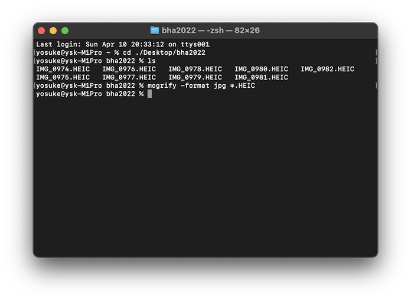
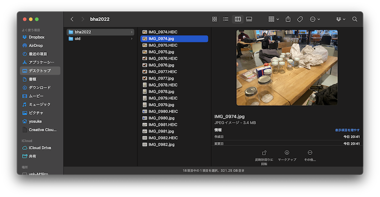

ImageMagickを使って画像を一気に特定の形式へ変換する方法。
注：Mac ユーザー向けです。Windowsはのちに調べて追記できれば追記してみる予定。

### Install

まず、Image Magickをインストールします。[Image Magick](https://imagemagick.org/script/download.php) のホームページを参考に。HomeBrewを使ってインストールします。Home Brewがわからない人は、とりあえず[この辺のページ](https://brew.sh/index_ja)を見てみて、インストールしてみてください。

Mac でターミナルを開きます。ターミナルの場所は「アプリケーション」の「ユーティリティ」の中にあります。


ターミナルを開いて

```
brew install imagemagick
```

と入力すればimagemagickをインストールできます。


### Convert many HEIC image files to JPEG with one phrase.

まず、変換したい画像ファイルを、デスクトップ等にフォルダを作って保存します。ここでは、デスクトップ上の「bha2022」というフォルダを作成し、その中に保存するとします。


ターミナルを開きます。ターミナルを開いた時に最初に表示される場所は、ユーザーのホームフォルダ（/Users/<username>/）の中になります。ですので、デスクトップの中のbha2022というフォルダまで移動しなければいけません。以下の通りコマンドを入力し、Enterキーを押します。cd で change directory の意味です。

```
cd ./Desktop/bha2022/
```


ちゃんと移動できているか確認するために ls と入力してみましょう。保存してある画像ファイルのリストが表示されていれば、ちゃんと移動されています。


ImageMagickの操作は全てターミナル上で行います。ここでは、いまいるフォルダの中にある画像を全てJPEG形式に変換したい場合は、以下のように入力し、Enterキーを押します。

```
mogrify -format jpg *.HEIC
```



成功すれば、特にエラー表示せずに変換されます。JPEGファイルは同じフォルダに作成されます。もう1度 ls コマンドを入力し Enterキーを押してみましょう。


また、FinderでもJPEGファイルができているか確認します。



### Convert many image files with downsiging each images.

変換したい画像を一括で変換し、さらにファイルサイズを小さくしたい場合は、以下のように記載します。

```
mogrify -quality 50% -resize 1000 *.jpg
```


- quality XX% のところで、いまいまのイメージよりも何%の質の画像とするかを決めます。
- resize XXX のところでは、幅（width）と高さ（height）のピクセル数を入力します。数字１つだけを入力すると、幅のサイズのみ決定し、幅は写真の縦横比から自動的に計算されます。

たとえば、上記の例は、クオリティを50パーセントに、画像の幅を1000pxに指定しています。実際に、Finderから確認してみると、幅が1000pxになっていることがわかります。


### 他のコマンド等

[こちらのページ](http://academy.cba.mit.edu/classes/computer_design/image.html)をご参照ください。